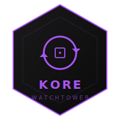

<p align="center">
  
</p>

# kore-watchtower

Mises à jour automatiques des conteneurs Docker sur le VPS KORE — **opt-in par label**.

## L'écosystème KORE

Chaque brique suit la même logique : extraite ou construite sur une base réelle, documentée, testée, utile.

| Brique | Description | Statut |
|---|---|---|
| [kore-hexagonal](https://github.com/alak8ba/kore-hexagonal) | Architecture hexagonale Java/Spring Boot • 1,5 an de production réelle | Disponible |
| [kore-batch](https://github.com/alak8ba/kore-batch) | Traitement batch • plusieurs années de production | Disponible |
| [kore-genie](https://github.com/alak8ba/kore-genie) | Socle IA privée & RAG • déploiement on-premise | Disponible |
| [kore-n8n](https://github.com/alak8ba/kore-n8n) | Automatisation self-hosted • n8n • Docker • Traefik | Disponible |
| [kore-traefik](https://github.com/alak8ba/kore-traefik) | Reverse proxy mutualisé • TLS + sécurité transverse au proxy | Disponible |
| [kore-monitoring](https://github.com/alak8ba/kore-monitoring) | Observabilité VPS • Prometheus + Loki + Grafana + Alertmanager | Disponible |
| **[kore-watchtower](https://github.com/alak8ba/kore-watchtower)** | **Mises à jour auto des conteneurs Docker opt-in par label** | **Disponible** |
| [kore-backup](https://github.com/alak8ba/kore-backup) | Snapshots chiffrés (restic) vers stockage distant + drill | Disponible |
| kore-stream | Traitement de flux temps réel | Prévu |
| kore-react | Composants frontend réutilisables | Prévu |

Chaque brique vit dans son propre dossier sur le VPS (`/opt/watchtower`, `/opt/traefik`, …) et se branche sur le réseau partagé `traefik-public` quand nécessaire.

## Principe

Watchtower scrute périodiquement les images Docker des conteneurs **explicitement opt-in** via le label :

```yaml
labels:
  - "com.centurylinklabs.watchtower.enable=true"
```

Les conteneurs sans ce label sont **ignorés**. C'est volontaire : on ne veut pas qu'un cache Redis ou une DB se fasse `pull` + `restart` sans contrôle.

## Démarrage

```shell
cp .env.prod.example .env.prod
# editer .env.prod (interval, notif Slack/email optionnelle)
docker compose --env-file .env.prod -f docker-compose.prod.yml up -d
```

## Configuration

Voir [.env.prod.example](.env.prod.example) pour les variables disponibles.

## Sécurité

- Le conteneur est en `read_only` + `no-new-privileges`.
- Il monte `/var/run/docker.sock` en **lecture seule**.
- Aucun port exposé sur l'hôte.
